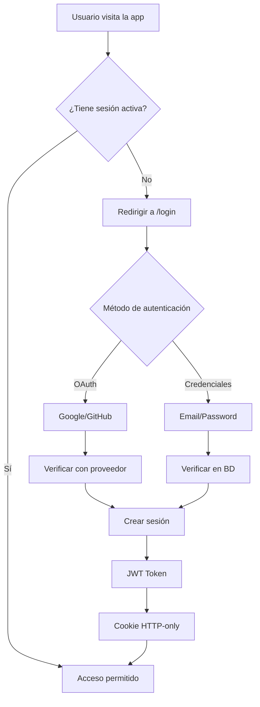

# 🔐 Autenticación en Next.js con Auth.js

## Introducción

La **autenticación** es uno de los pilares fundamentales de cualquier aplicación web moderna. Permite identificar a los usuarios, proteger recursos sensibles y personalizar la experiencia de cada persona que utiliza tu aplicación.

En esta sección aprenderás a implementar un sistema de autenticación robusto y profesional utilizando **Auth.js** (anteriormente conocido como NextAuth.js), la solución de autenticación más popular y completa para aplicaciones Next.js.

---

## 🎯 ¿Qué lograrás en esta sección?

Al finalizar este módulo serás capaz de:

- ✅ Implementar autenticación completa con múltiples proveedores
- ✅ Integrar inicio de sesión con Google y GitHub
- ✅ Crear un sistema de credenciales personalizado (email/password)
- ✅ Encriptar y validar contraseñas de forma segura
- ✅ Manejar sesiones de usuario tanto en servidor como en cliente
- ✅ Proteger rutas y recursos de tu aplicación
- ✅ Personalizar el perfil de usuario con campos adicionales
- ✅ Construir las bases de un dashboard administrativo seguro

---

## 🤔 ¿Por qué Auth.js?

Auth.js es la solución de facto para autenticación en Next.js por varias razones:

### Ventajas principales

1. **🔌 Integración nativa con Next.js**
   - Diseñado específicamente para el App Router y Server Components
   - Soporte completo para SSR y CSR
   - Middleware integrado para protección de rutas

2. **🌐 Múltiples proveedores out-of-the-box**
   - OAuth (Google, GitHub, Facebook, Twitter, etc.)
   - Credenciales personalizadas
   - Magic links (enlaces por email)
   - Web3 / Crypto wallets

3. **🔒 Seguridad por defecto**
   - CSRF protection
   - Tokens JWT seguros
   - Sesiones encriptadas
   - HTTP-only cookies

4. **📦 Altamente extensible**
   - Callbacks personalizables
   - Adaptadores para múltiples bases de datos
   - Eventos para logging y auditoría

5. **🎨 Flexible y personalizable**
   - Páginas de login totalmente customizables
   - Control total sobre el flujo de autenticación
   - Fácil integración con tu diseño

---

## 🗺️ Ruta de aprendizaje

### Fase 1: Fundamentos

Comenzaremos con lo básico: instalación y configuración inicial de Auth.js, entendiendo cómo funciona el sistema de sesiones y cómo proteger rutas.

### Fase 2: Proveedores OAuth

Implementaremos autenticación social con Google y GitHub, aprendiendo a configurar aplicaciones OAuth y manejar el flujo de autorización.

### Fase 3: Credenciales personalizadas

Crearemos nuestro propio sistema de registro e inicio de sesión con email y contraseña, incluyendo encriptación segura con bcrypt.

### Fase 4: Base de datos y relaciones

Conectaremos Auth.js con nuestra base de datos para persistir usuarios, sesiones y tokens, estableciendo relaciones adecuadas.

### Fase 5: Personalización avanzada

Extenderemos el modelo de usuario con campos adicionales, modificaremos callbacks y adaptaremos Auth.js a nuestras necesidades específicas.

### Fase 6: Validación y seguridad

Implementaremos validaciones tanto en servidor como en cliente para garantizar la integridad y seguridad de los datos.

---

## 🔑 Conceptos clave que aprenderás

### 1. **Sesión de usuario**

```typescript
// Acceder a la sesión en Server Components
import { auth } from '@/auth';

const session = await auth();
console.log(session?.user);
```

### 2. **Protección de rutas**

```typescript
// Middleware para rutas protegidas
export { auth as middleware } from '@/auth';

export const config = {
  matcher: ['/dashboard/:path*', '/admin/:path*']
};
```

### 3. **Proveedores OAuth**

```typescript
// Configuración de múltiples proveedores
providers: [
  Google({ clientId, clientSecret }),
  GitHub({ clientId, clientSecret }),
  Credentials({ /* custom logic */ })
]
```

### 4. **Encriptación segura**

```typescript
// Hash de contraseñas con bcrypt
import bcrypt from 'bcryptjs';

const hashedPassword = await bcrypt.hash(password, 10);
const isValid = await bcrypt.compare(password, hashedPassword);
```

---

## 🎓 Prerequisitos

Para aprovechar al máximo esta sección, deberías estar familiarizado con:

- ✅ Fundamentos de Next.js 14+ (App Router)
- ✅ React y TypeScript básico
- ✅ Server Components vs Client Components
- ✅ Conceptos básicos de HTTP y cookies
- ✅ Bases de datos relacionales (opcional pero recomendado)

---

## 🛠️ Herramientas que utilizaremos

| Herramienta | Propósito |
|-------------|-----------|
| **Auth.js v5** | Framework de autenticación |
| **Prisma** | ORM para base de datos |
| **PostgreSQL** | Base de datos relacional |
| **bcryptjs** | Encriptación de contraseñas |
| **Zod** | Validación de schemas |
| **React Hook Form** | Manejo de formularios |

---

## 🌟 Casos de uso reales

Lo que aprenderás en esta sección te permitirá construir:

- 📱 Aplicaciones SaaS con múltiples usuarios
- 🛒 E-commerce con cuentas de cliente
- 📊 Dashboards administrativos
- 🎓 Plataformas educativas
- 💬 Redes sociales y comunidades
- 📝 Sistemas de gestión de contenido (CMS)

---

## 🔐 Flujo de autenticación que construiremos



---

## 💡 Mejores prácticas que aprenderás

1. **Nunca almacenes contraseñas en texto plano**
   - Siempre usa hashing (bcrypt, argon2)
   - Nunca compartas el hash en respuestas API

2. **Valida en servidor, siempre**
   - La validación del cliente es solo UX
   - Toda validación crítica debe ocurrir en el servidor

3. **Usa HTTP-only cookies para tokens**
   - No almacenes tokens en localStorage
   - Protege contra XSS

4. **Implementa rate limiting**
   - Previene ataques de fuerza bruta
   - Protege endpoints de autenticación

5. **Maneja errores de forma segura**
   - No reveles información sensible
   - Mensajes genéricos para intentos fallidos

---

## 🚀 ¿Listo para comenzar?

La autenticación puede parecer compleja al principio, pero siguiendo esta sección paso a paso construirás un sistema robusto, seguro y escalable.

**Recuerda**: La seguridad no es un feature opcional, es un requisito fundamental. Cada decisión que tomemos en esta sección estará orientada a construir una aplicación segura y confiable.

---

### 📌 Próximos pasos

En la siguiente lección instalaremos y configuraremos Auth.js, entenderemos su arquitectura básica y crearemos nuestra primera ruta protegida.

**¡Vamos a construir un sistema de autenticación de nivel profesional! 🔥**

---

## 📚 Recursos útiles

- [Auth.js Documentation](https://authjs.dev/)
- [Next.js Authentication](https://nextjs.org/docs/app/building-your-application/authentication)
- [OWASP Authentication Cheat Sheet](https://cheatsheetseries.owasp.org/cheatsheets/Authentication_Cheat_Sheet.html)
- [OAuth 2.0 Simplified](https://www.oauth.com/)

---

*"La autenticación es la puerta de entrada a tu aplicación. Construyámosla sólida."* 🚪🔐
